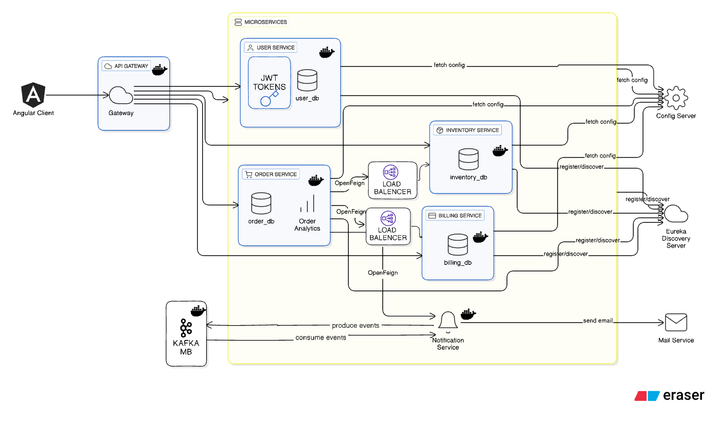
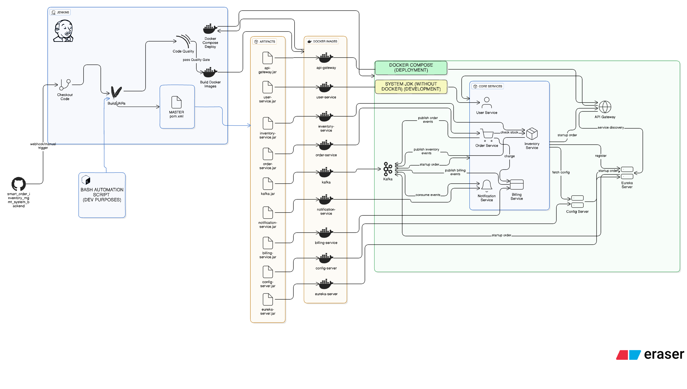

# Chubb Capstone — Smart Order Inventory Management 

This repository is a compilation of my frontend and backend repositories in one place.

---

## Links for my code repositories

- Frontend: https://github.com/QuantumSoham/smart_order_inventory_mgmt_system_frontend
- Backend: https://github.com/QuantumSoham/smart_order_inventory_mgmt_system_backend
- Config Server: https://github.com/QuantumSoham/inventory-config-server-repo

---

## Architecture & Diagrams — System Overview

### System design / architecture

### CI/CD & Deployment diagram

## Spring AI and Agent Server Architecture

## ER Diagrams 

### Sequence diagram (request flows)

---

## Table of contents

- [About](#about)
- [Features](#features)
- [Tech stack](#tech-stack)
- [Screenshots](#screenshots)
- [Local setup](#local-setup)
- [Development & CI/CD](#development--cicd)
- [Contributing](#contributing)
- [License](#license)
- [Contact](#contact)

---

## About

This project implements a smart inventory and order management system with the following goals:
- Track inventory across locations
- Automate reorder suggestions and order creation
- Provide a responsive web UI for inventory and order management
- Demonstrate a production-ready architecture with CI/CD and deployment diagrams

---

## Features

- Product and inventory management
- Orders, suppliers, and purchase workflows
- Notifications for low stock
- Role-based access and simple auth (see backend)
- REST API backend and React (or similar) frontend (see repositories linked above)

---

## Tech stack

- Frontend: (see frontend repo) — likely React / TypeScript / CSS framework
- Backend: (see backend repo) — Node/Express or Python/Flask (see backend repo for exact stack)
- Database: PostgreSQL / MongoDB (configured in backend repo)
- CI/CD: Automated pipelines for tests, builds, and deployment (diagram included above)

---

## Screenshots

(Use these sections to show UI screenshots or important flows. Example:)

---

## Local setup

1. Clone the repositories:
   - Frontend: `git clone https://github.com/QuantumSoham/smart_order_inventory_mgmt_system_frontend.git`
   - Backend: `git clone https://github.com/QuantumSoham/smart_order_inventory_mgmt_system_backend.git`

2. Follow each repo's README for environment setup, installing dependencies, and running locally.

3. If you want to run both services together:
   - Start the backend service and ensure its API is reachable (default port documented in backend README).
   - Start the frontend and point its API base URL to your running backend.

---

## Development & CI/CD

- CI runs: tests, linting, build steps (see CI/CD pipeline in backend/frontend repos).
- Deployment: diagrams above show the intended deployment topology (cloud provider, containerization, load balancer, database, etc.)
- Add workflows or pipeline YAML into `.github/workflows/` in the frontend/backend repos as needed.

---

## Contributing

Contributions are welcome. Suggested workflow:
1. Fork the repository.
2. Create a new branch: `git checkout -b feat/your-feature`
3. Make changes and add tests where applicable.
4. Open a pull request describing your changes.

Please follow the code style and run linters/tests before opening PRs.

---

## License

Specify your license here (e.g., MIT). Example:

MIT © QuantumSoham

---

## Contact

Project lead: QuantumSoham  
Repository: https://github.com/QuantumSoham/chubb-capstone-inventory-mgmt

